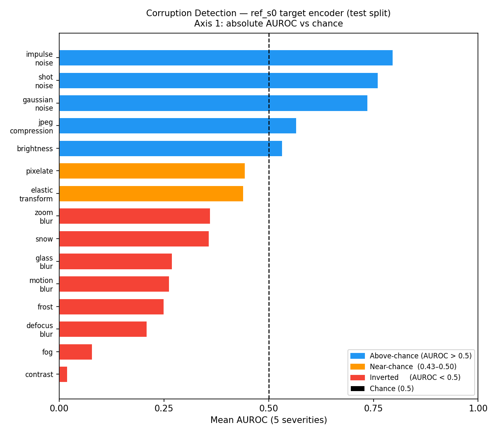
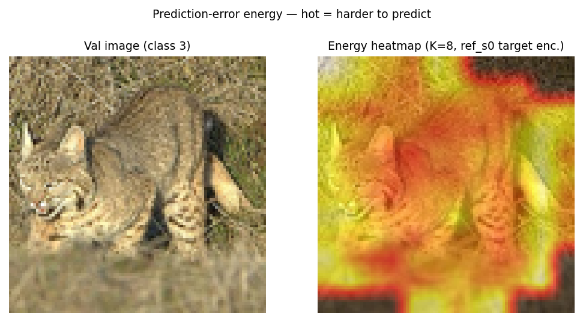

# jepa-vision

Self-supervised anomaly detection with I-JEPA on STL-10. A ViT-Tiny (~3M trainable params) trained with masked latent prediction on 100k unlabeled images produces two complementary anomaly signals from a single frozen encoder: a prediction-error energy readout for corruption detection, and a Mahalanobis density readout for semantic domain shift.

**Binding claim (Phase 1, sealed test set, three seeds):** "Latent prediction error detects complexity-adding corruption (noise-family AUROC 0.74–0.80 at test, ≥0.92 at maximum severity) and inverts on complexity-reducing corruption; it exceeds the pixel-variance baseline on 8/15 types (3 clearly). The same frozen encoder's feature density detects semantic domain shift (mahal_tgt SVHN 0.986, CIFAR-10 0.864 at test, probe-pool fit, no additional training) and is strongest on precisely the energy-inverted types. Inversion mechanism: prediction difficulty, Spearman ρ=0.770 (pooled val+SVHN). Two readouts, one encoder."

---

## Results



*Fig. 1 — Corruption AUROC (ref_s0 target encoder, test split). Axis 1: absolute detection vs chance. Blue = above-chance (5/15); orange = near-chance (2/15); red = inverted, AUROC < 0.5 (8/15). Dashed line = chance (0.5).*



*Fig. 2 — Prediction-error energy heatmap (K=8 mask samples, ref_s0 target encoder). Hot patches = harder to predict. Natural texture regions accumulate higher energy than smooth regions — the mechanism that causes energy to invert on low-complexity corruptions.*

### Compact results (test split, R3 run-2, 2026-07-14)

| Readout | Metric | Value |
|---|---|---|
| Energy — gaussian noise | AUROC (mean 5 sev.) | 0.736 |
| Energy — shot noise | AUROC (mean 5 sev.) | 0.760 |
| Energy — impulse noise | AUROC (mean 5 sev.) | 0.796 |
| Energy — impulse (max severity) | AUROC sev. 5 | 0.919 |
| Energy — brightness | AUROC (mean 5 sev.) | 0.532 |
| Energy — jpeg compression | AUROC (mean 5 sev.) | 0.566 |
| mahal_tgt — SVHN | AUROC | **0.986** [0.984, 0.987] |
| mahal_tgt — CIFAR-10 | AUROC | **0.864** [0.858, 0.869] |
| Linear probe n=40 vs scratch | Gap (val) | +2.8pp (> combined seed spread) |
| Linear probe n=4000 vs scratch | Gap (val) | −6.5pp (scratch wins) |

*mahal_tgt: Mahalanobis on ref_s0 frozen target-encoder features, fit on 4k probe pool, no labels, no additional training. Bootstrap 95% CIs over 8k test images.*

Full tables, per-severity CIs, probe grids, and gate rulings: [reports/phase1.md](reports/phase1.md).

---

## Quickstart

```bash
# 1. Install dependencies (uv required)
uv sync

# 2. Patch imagecorruptions library (glass_blur + fog compatibility fix — idempotent)
uv run python scripts/patch_imagecorruptions.py

# 3. Download STL-10 (first run auto-downloads to data/)
#    Val split is committed at data/splits/stl10_val_idx.json — do not regenerate.

# 4. Train (three reference seeds)
uv run python scripts/train.py --config configs/phase1_ref.yaml --seed 0
uv run python scripts/train.py --config configs/phase1_ref.yaml --seed 1
uv run python scripts/train.py --config configs/phase1_ref.yaml --seed 2

# 5. Val benchmark (energy + OOD + probe, val split)
uv run python scripts/terminal_benchmark.py \
  --ref_ckpts runs/<s0_id>/epoch_0150.ckpt \
              runs/<s1_id>/epoch_0150.ckpt \
              runs/<s2_id>/epoch_0150.ckpt \
  --split val \
  --out reports/terminal_val_new.md

# 6. Probe sweep (val)
uv run python scripts/probe_sweep.py --config configs/phase1_ref.yaml

# 7. Regenerate Phase 1 figures
uv run python scripts/gen_phase1_figs.py
```

**Note on the test set:** STL-10 test was opened once (R3 run-2, 2026-07-14) under the pre-registered protocol. All numbers in the report are from that single run. Do not re-run `--split test --unlock_test` without reading DECISIONS.md [1.6h] runsheet and re-opening both approvals.

---

## Evaluation Discipline

This project follows a pre-registered experimental protocol to prevent evaluation leakage and post-hoc rationalization.

- **Decision rules pre-registered:** Gate criteria, claim language, and branching logic are written to [PLAYBOOK.md](PLAYBOOK.md) and [DECISIONS.md](DECISIONS.md) before measurements are taken. The decision tree in PROJECT_STATE.md is the single source of truth for what action a given result triggers.
- **Single-open sealed test set:** STL-10 test (8k images) opened exactly once. Val split (1k images, stratified 100/class) was committed to `data/splits/stl10_val_idx.json` before any model training. Model selection and hyperparameter sweeps use val only.
- **Three-seed protocol:** All reported claims require ≥3 independent training seeds. Probe accuracy variation reported as training-seed σ (dominant) and probe-seed σ (< 0.005, secondary).
- **Append-only DECISIONS.md:** All irreversible choices, deviations, and gate rulings are logged with date and approver. No entry is ever removed or amended — corrections are new entries.
- **No executor gate declarations:** Gate PASS/FAIL verdicts are human decisions. The executor computes evidence and presents it; the human records the ruling.

---

## Repo Map

```
configs/
  phase1_ref.yaml       reference training config (patch_size=8, 144 tokens, fp32 on MPS)
  mae_baseline.yaml     MAE comparator config

src/
  models/
    jepa.py             VisionJEPA (ViT-Tiny encoder + EMA target + predictor)
    mae.py              PixelMAE baseline
    loss.py             SIGReg anti-collapse regulariser (sigreg_term verbatim from cocktail)
  eval/
    energy.py           image_energy(), energy_heatmap()
    probe.py            linear probe (z-score normalised, val-fit statistics)
    baselines.py        pixel_std, random_init, Mahalanobis readouts
    evaluate.py         auroc(), bootstrap CI
    bootstrap.py        bootstrap utilities
  loop.py               training loop (AdamW, cosine-warmup, EMA, AMP stub)
  checkpoint.py         save/load with W&B artifact upload
  data/
    stl10.py            STL-10 loaders (unlabeled, labeled, val, test)

scripts/
  train.py              training entry point
  terminal_benchmark.py full evaluation harness (Stage 1–4, val + test)
  probe_sweep.py        linear probe grid (n × lr × seed)
  probe_on_test.py      test-split probe evaluation (Stage 4b)
  gen_phase1_figs.py    generate reports/figs/ from existing data
  patch_imagecorruptions.py  idempotent library patch (glass_blur, fog)

data/
  splits/
    stl10_val_idx.json  committed val split (seed=0, 100/class × 10)

reports/
  phase1.md             Phase 1 final report (FINAL — 2026-07-17)
  terminal_test.md      R3 run-2 raw numbers (all test-derived values)
  figs/                 figures referenced in phase1.md
  review_export/        frozen export for reviewer

DECISIONS.md            append-only log of irreversible choices and gate rulings
PLAYBOOK.md             experiment protocol and decision tree
PROJECT_STATE.md        run ledger and current phase/step
```

---

## Limitations

Energy alone inverts on low-complexity corruptions (defocus, contrast, fog, SVHN). The density readout (mahal_tgt) compensates but requires a class-balanced probe pool. The ~0.58 probe ceiling with both levers tested (duration + masking difficulty) reflects ViT-Tiny capacity, no color augmentation, and constrained pretraining scale — not an open tuning problem.

Full limitations: [reports/phase1.md §8](reports/phase1.md).
